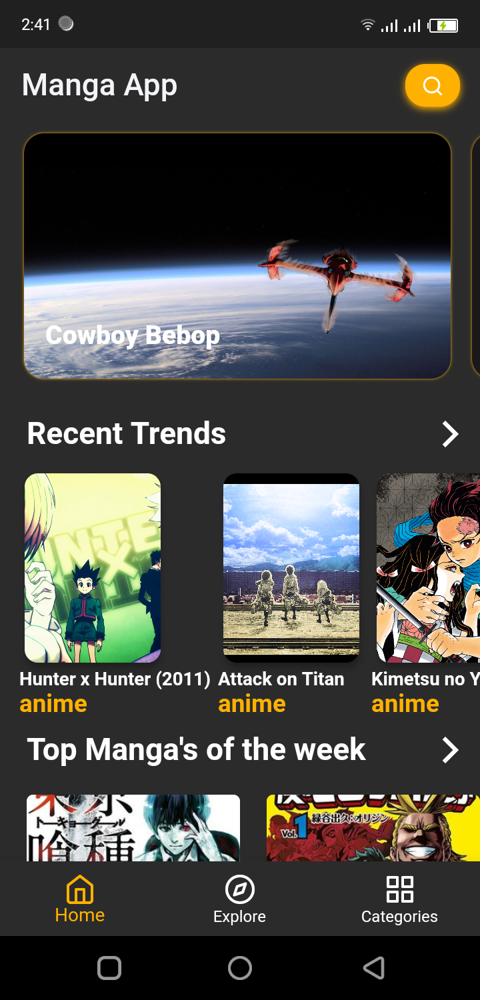
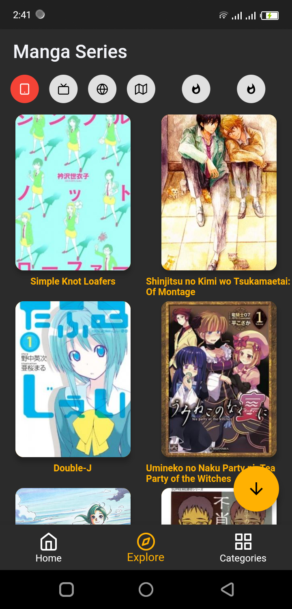
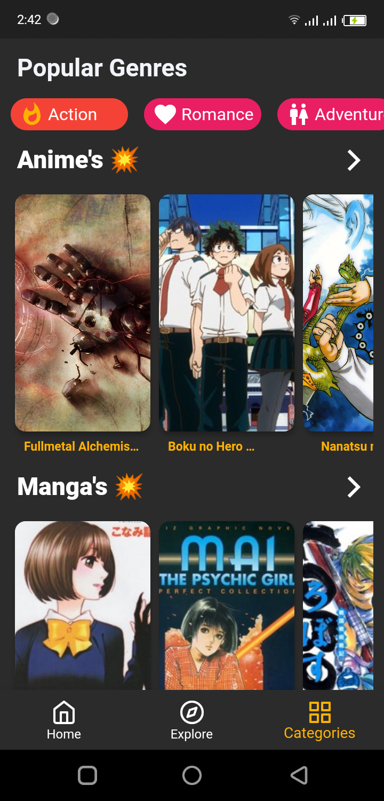
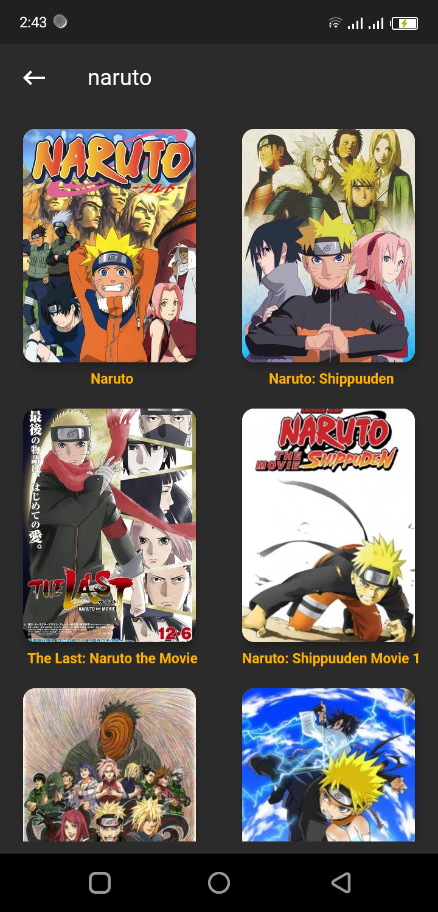
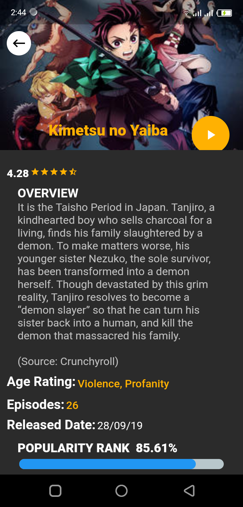

# MangA

Anime and Manga app built for android and ios on flutter
Its open source you're free to use it for any purpose 

NOTE: You have to fill in your own api keys from kitsu the data provider for the app

# SS

